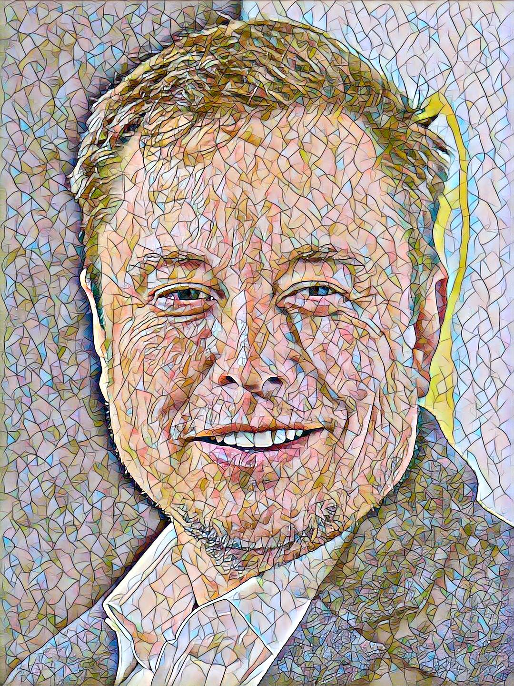

# Style Transfer using ML

<p align="center">
    
    
    
</p>

# Dependencies

[][Streamlit]

[][pytorch]

<br />

# Languages and Tools

[][python]
[][jupyter notebook]
[][Visual Studio Code]
[][git]
[][github]
[][terminal]

<br />

# References
Based on this fast neural style code:
[Fast Neural Style](https://github.com/pytorch/examples/tree/master/fast_neural_style)

# Installation
It is recommended to use a virtual environment before installing the dependencies

### Create conda environment
Therefore, we will create a conda environment called *performance*
```
conda create -n performance python=3.7.9
```
Then, we will login to the *performance* environement
```
conda activate performance
```

### Install prerequisite libraries

Download requirements.txt file

```
wget https://raw.githubusercontent.com/FouziaFaria/style-transfer/main/requirements.txt

```

Pip install libraries
```
pip install -r requirements.txt
```

# Usage
Download the pretrained models

<div align='center'>
  
</div>

<div align='center'>
  
  
  
  
  <br>
  
  
  
  
</div>

```console
python download_saved_models.py
```

Move the *saved_models* folder into the *neural_style* folder.

Run
```console
streamlit run app.py
```

[Streamlit]: https://streamlit.io/
[pytorch]: https://pytorch.org/
[python]: https://www.python.org/
[jupyter notebook]: https://jupyter.org/
[Visual Studio Code]: https://code.visualstudio.com/
[git]: https://git-scm.com/
[github]: https://github.com/
[terminal]: https://sourceforge.net/projects/windows-terminal.mirror/
